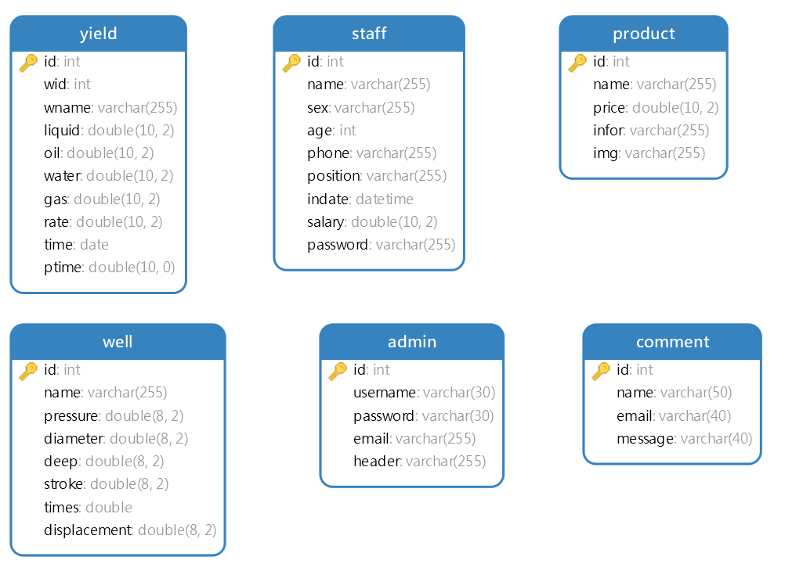

# oilyield

## Introduction

Oilfield production analysis and early warning system

## Software Architecture

> Technology stack: `SpringBoot` + `MySQL` + `SpringSecurity`+ `LayUI` + `Redis` + `Elasticsearch` + `RabbitMQ`

- **Participants**
   Reservoir Engineers and Managers

- **Technical Summary**
   Front-end and back-end separation based on `Springboot` + `themeleaf`

   Read-write separation based on `Redis` + `SpringCache`

   Search auto-completion based on `Elasticsearch`

   Mail delivery based on `RabbitMQ`

- **The main function** 

   - **Backstage**

     Administrator information management, user information management, single well information management, production information management, product information management, message review, production abnormal warning, group production analysis, user login authority verification, etc.

   - **front desk**

     Company homepage information introduction, product display, user registration and login, user information modification, about us, contact us (message)

   - **Data analysis: Based on historical output analysis data (Echarts implementation)**

     Alert the abnormal data of the oil well during the operation of the oil well according to the threshold requirements, and use the staggered positive and negative axis histogram to calibrate the abnormal and normal data;

     The single well production of oil and gas wells is queried according to the combination of `year, month` + `single well name` + liquid production type (gas, liquid, oil, water) + `time` and displayed in a line chart;

     For single well production of oil and gas wells, analyze the proportion of single well liquid production type (gas, liquid, oil, water) according to `single well name` + `time` and display it in a fan diagram;

     According to the different groups of single wells of oil and gas wells, the production data of different single wells are searched between groups based on the combination of conditions such as `year, month` + `group` + `liquid production type (gas, liquid, oil, water)` + `time` Compare and display in a histogram.

   - **Read-write separation + search auto-completion**

     Use Redis to cache single well information and single well production information to add, delete, modify and query operations, and use `Bloom filter` to solve the problem of cache penetration

     The single well name of the single well information search and production information search is automatically completed using Elasticsearch integration, and the relevant `single well name` can be given for selection according to the input.

   - **Mail delivery based on message queue**

     Use the `RabbitMQ` message queue to achieve mail delivery when the user logs in by mailbox, improving system reliability, asynchronous processing speed, and decoupling.

- **Database Design**

   

   - 演示图

     

     

- **在线演示地址**
  [项目地址](http://162.14.77.92:9732/index.html?language=zh_CN  "项目地址")  

## Installation

1.  Waiting...

## Instructions

1.  Please refer to the technology stack to install the necessary running service support.
2. This system is initially built in the `Win` system, and later deployed to the `Linux` server based on `Centos7`
3. For the Win system, please download the corresponding service and use SpringBoot to start the support; for the Linux system, it is recommended to use Docker to configure the image and enable the container.

## Contribution

1.  Fork the repository
2.  Create Feat_xxx branch
3.  Commit your code
4.  Create Pull Request
