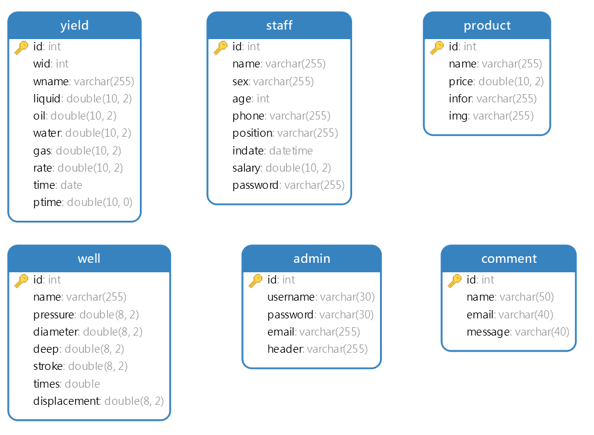

# oilyield

## 介绍

油田产量分析预警系统

## 软件架构

> 技术栈: `SpringBoot` + `MySQL` + `SpringSecurity`+ `LayUI` + `Redis` + `Elasticsearch` + `RabbitMQ` 

- **参与者**
  油藏工程师和管理员

- **技术概要**
  基于 `Springboot` + `themeleaf` 实现前后端分离

  基于 `Redis` + `SpringCache` 实现读写分离

  基于 `Elasticsearch` 实现搜索自动补全

  基于 `RabbitMQ` 实现邮件投递

- **主要功能** 

  - **后台**

    管理员信息管理、用户信息管理、单井信息管理、产量信息管理、产品信息管理、留言信息审阅、产量异常预警、分组产量分析、用户登录权限校验等。

  - **前台**

    公司主页信息介绍、产品展示、用户注册和登录、用户信息修改、关于我们、联系我们(留言)

  - **数据分析: 基于历史产量分析数据(Echarts 实现)**

    对油井运行过程中油井的异常数据根据阈值要求进行警示,并使用交错正负轴柱状图对异常和正常数据进行标定;

    对油气井单井产量按 `年、月` + `单井名称` + 产液类型(气、液、油、水) + `时间` 等条件组合查询并以折线图展示; 

    对油气井单井产量按 `单井名称` + `时间 ` 分析单井产液类型(气、液、油、水)占比并以扇形图展示;

    根据油气井单井不同分组在组间依据 `年、月` + `分组` + `产液类型(气、液、油、水)` + `时间 `等条件组合查询对不同单井生产数据进行比较并以柱状图展示。

  - **读写分离 + 搜索自动补全**

    使用 Redis 缓存单井信息与单井产量信息的增删改查操作, 使用 `布隆过滤器` 解决缓存穿透问题

    对单井信息搜索和产量信息搜索的单井名称使用 Elasticsearch 集成自动补全, 能够根据输入给出相关 `单井名称` 供以选择。

  - **基于消息队列实现邮件投递**

    使用 `RabbitMQ` 消息队列实现用户邮箱方式登录时的邮件投递, 提高系统可靠性、异步处理速度、解耦合。

- **数据库设计**

  

## 安装教程

1.  Waiting...

## 使用说明

1.  请参照技术栈, 安装必要的运行服务支持。
2.  本系统初步构建在 `Win` 系统中, 后期部署到基于 `Centos7` 的 `Linux` 服务器中
3.  Win 系统请下载对应的服务, 并使用 SpringBoot 启动支持; Linux 系统推荐使用 Docker 配置镜像, 并在启用容器。

## 参与贡献

1.  Fork 本仓库
2.  新建 Feat_xxx 分支
3.  提交代码
4.  新建 Pull Request

